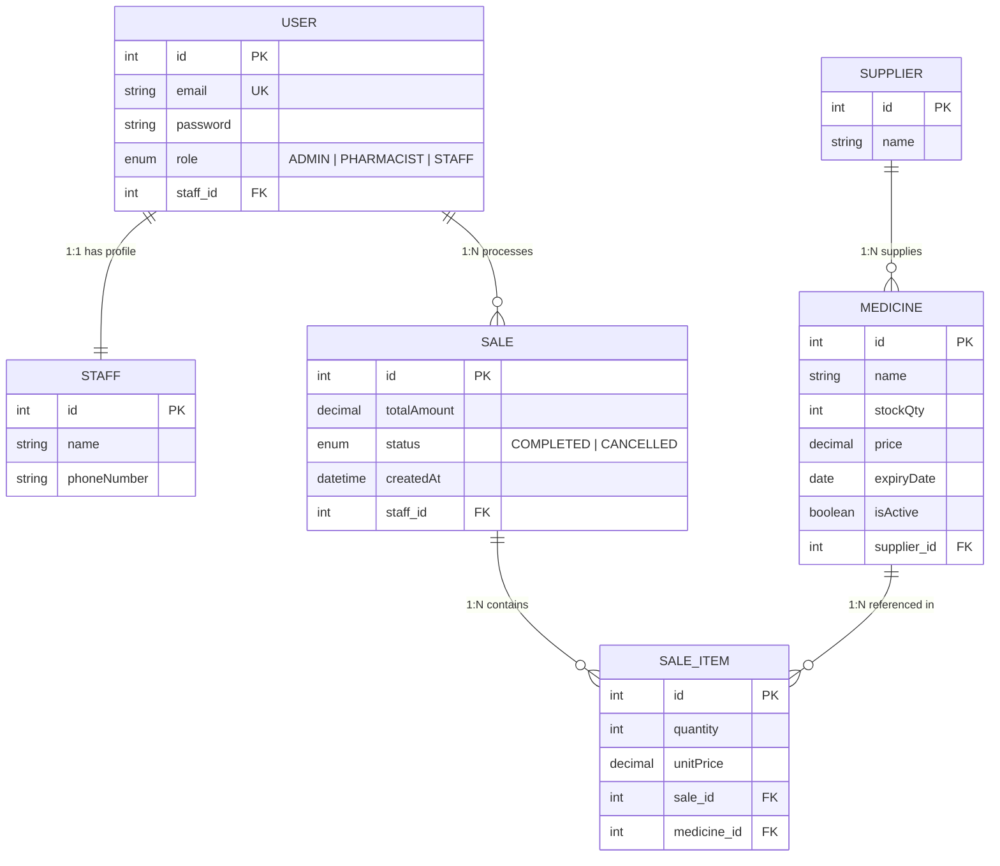

# 💊 Pharmacy Management System

> NestJS-based Backend API for Pharmacy Inventory & Sales Management  
> Internship Project · Hanseong Kim · 2026

---

## Table of Contents

- [Overview](#overview)
- [Tech Stack & Rationale](#tech-stack--rationale)
- [Architecture](#architecture)
- [Data Model (ERD)](#data-model-erd)
- [Core Features](#core-features)
- [Security Design](#security-design)
- [Transaction Flow](#transaction-flow)
- [API Documentation](#api-documentation)
- [Getting Started](#getting-started)

---

## Overview

This project provides a single REST API covering **inventory management**, **sales processing**, and **staff permission control** for real-world pharmacy operations.  
Beyond simple CRUD, the design proactively addresses **concurrency issues** and **privilege abuse** scenarios that can arise in production environments.

---

## Tech Stack & Rationale

| Layer | Technology | Rationale |
|---|---|---|
| Framework | **NestJS 11** | Module-based architecture ensures clear separation of concerns. Angular-style DI container improves testability and keeps structure intact at scale. |
| ORM | **TypeORM 0.3** | TypeScript decorator-based entity definitions are intuitive. The `DataSource.transaction` API makes it explicit and safe to bundle multiple Repository operations into a single transaction. |
| Database | **PostgreSQL** | Full ACID transaction support. Provides the foundation for applying Optimistic/Pessimistic Lock strategies to critical sections such as stock deduction. |
| Auth | **JWT + Passport** | Stateless authentication eliminates session sync issues during horizontal scaling. Custom `passport-jwt` strategy embeds `role` in the token payload, minimizing authorization overhead per request. |
| Validation | **class-validator** | Declaratively filters requests at the DTO layer. The `whitelist: true` + `forbidNonWhitelisted: true` options ensure unknown fields never pass through to the server internals. |
| Docs | **Swagger (OpenAPI 3)** | Auto-generates API specifications so reviewers and collaborators can inspect the API without reading code. `addBearerAuth()` enables authentication testing directly from the Swagger UI. |

---

## Architecture

```
src/
├── auth/                   # Dedicated authentication module
│   ├── auth.service.ts     #   bcrypt password verification + JWT issuance
│   ├── jwt.strategy.ts     #   Token validation & request.user injection
│   └── auth.module.ts
│
├── common/
│   ├── decorators/
│   │   └── roles.decorator.ts   # @Roles() metadata setup
│   └── guards/
│       └── roles.guard.ts       # RBAC access control (Reflector-based)
│
└── modules/
    ├── users/              # Separate design: User (account) + Staff (employee profile)
    ├── medicines/          # Medicine inventory management (with Supplier relation)
    ├── suppliers/          # Supplier master data
    └── sales/              # Sales processing (core transaction logic)
```

**Design philosophy**: Each module fully encapsulates its own domain entity, service, controller, and DTOs.  
Inter-module dependencies are managed exclusively through NestJS `exports/imports`, keeping dependency direction unidirectional.

---

## Data Model (ERD)



### User ↔ Staff: Separating Account from Profile

`User` holds only **authentication data** (email, password, role),  
while `Staff` holds only **business profile data** (name, contact info, and other HR attributes).

This 1:1 separation design yields two concrete benefits:

1. **Security**: The table containing passwords is structurally isolated from the business data table, eliminating the risk of employee profile query APIs exposing authentication credentials.
2. **Extensibility**: When adding social login (OAuth), only the `User` table needs new columns — the `Staff` profile logic remains unchanged.

---

## Core Features

| Feature | Endpoint | Permission |
|---|---|---|
| Login (JWT issuance) | `POST /auth/login` | Public |
| Register staff | `POST /users` | ADMIN |
| Add / update / delete medicine | `POST\|PATCH\|DELETE /medicines` | ADMIN, PHARMACIST |
| List medicines | `GET /medicines` | ALL |
| Manage suppliers | `POST\|GET /suppliers` | ADMIN |
| **Process sale** | `POST /sales` | PHARMACIST, STAFF |
| View sales history | `GET /sales` | ADMIN, PHARMACIST |

---

## Security Design

### 1. RBAC (Role-Based Access Control)

The `RolesGuard` is implemented using NestJS's `Reflector` to read metadata at both handler and class levels.  
The `getAllAndOverride` approach gives handler-level metadata priority over class-level metadata,  
enabling fine-grained control — set a default permission on the entire controller and override specific endpoints as exceptions.

```typescript
// Handler-level metadata takes priority over class-level metadata
const requiredRoles = this.reflector.getAllAndOverride<string[]>('roles', [
  context.getHandler(),  // Priority 1: method level
  context.getClass(),    // Priority 2: class level
]);
```

### 2. JWT Payload Design

Including `role` in the token payload allows role verification without a DB query on every request.  
Pairing `userId` (sub) with `email` ensures the `request.user` object carries all information needed for both authentication and authorization.

```typescript
const payload = { sub: user.id, email: user.email, role: user.role };
```

### 3. Password Security

- Passwords stored as one-way hashes via `bcrypt` (no plaintext storage)
- On login failure, both "email not found" and "wrong password" return the **same message** → defends against Account Enumeration attacks

```typescript
// Both missing email and wrong password return the same message
throw new UnauthorizedException('Email or Password is incorrect.');
```

### 4. Input Validation (ValidationPipe)

```typescript
app.useGlobalPipes(new ValidationPipe({
  whitelist: true,            // Automatically strips fields not declared in the DTO
  forbidNonWhitelisted: true, // Returns 400 if any undeclared field is present
  transform: true,            // Automatically transforms request data into DTO instances
}));
```

`whitelist` alone silently drops malicious extra fields, but combining it with `forbidNonWhitelisted` **explicitly rejects** unintended fields, immediately catching client-side contract violations.

---

## Transaction Flow

Processing a medicine sale requires two operations to execute **atomically**:

1. Decrement `Medicine.stockQty`
2. Create a `Sale` record

If either operation fails, both must roll back.  
To guarantee this, instead of the `Repository` pattern, `DataSource.transaction` is used so all operations share a single transaction context via a common `EntityManager`.

```mermaid
sequenceDiagram
    actor Client
    participant Controller as SalesController
    participant Service as SalesService
    participant DB as PostgreSQL

    Client->>Controller: POST /sales { medicineId, quantity }
    Controller->>Service: processSale(medicineId, quantity, staffId)

    Service->>DB: BEGIN TRANSACTION

    Service->>DB: SELECT * FROM medicine WHERE id = :id
    DB-->>Service: medicine { stockQty: 10 }

    alt Medicine not found or insufficient stock
        Service->>DB: ROLLBACK
        Service-->>Controller: 400 BadRequestException
        Controller-->>Client: HTTP 400
    else Sufficient stock
        Service->>DB: UPDATE medicine SET stockQty = stockQty - quantity
        Service->>DB: INSERT INTO sale (totalAmount, status, staff_id)
        Service->>DB: COMMIT
        DB-->>Service: Sale { id, totalAmount, status: "COMPLETED" }
        Service-->>Controller: Sale entity
        Controller-->>Client: HTTP 201 Created
    end
```



**Key decision: `DataSource.transaction` vs direct Repository calls**

| Approach | Transaction guaranteed | Problem |
|---|---|---|
| Sequential `medicineRepository.save()` + `salesRepository.save()` | ❌ | Independent connections — if the Sale INSERT fails after stock deduction, stock is not restored |
| `DataSource.transaction(async (manager) => { ... })` | ✅ | Same connection, same EntityManager — full atomicity guaranteed |

Because all operations run through the same `EntityManager` instance on a single DB connection,  
if the Sale record INSERT fails immediately after stock deduction, the deducted stock is **automatically restored**.

---

## API Documentation

After starting the server, all APIs can be tested directly via the Swagger UI at:

```
http://localhost:3000/api
```

> Click the **Authorize** button → enter `Bearer <access_token>` to test endpoints that require authentication.

---

## Getting Started

### Prerequisites

- Node.js 20+
- PostgreSQL 14+

### Installation

```bash
# Install dependencies
npm install

# Configure environment variables
cp .env.example .env
# Set DB connection info and JWT_SECRET in the .env file
```

### Environment Variables (`.env`)

```env
DB_HOST=localhost
DB_PORT=5432
DB_USERNAME=postgres
DB_PASSWORD=your_password
DB_NAME=pharmacy_db
JWT_SECRET=your_jwt_secret_key
```

### Running the App

```bash
# Development mode (file watch + auto-restart)
npm run start:dev

# Production build and run
npm run build
npm run start:prod
```

### Testing

```bash
# Unit tests
npm run test

# Coverage report
npm run test:cov
```

---

## Design Decisions Summary

```
✅ Data integrity   →  DataSource.transaction processes stock deduction and sale record as a single atomic unit
✅ Security         →  JWT RBAC + bcrypt + account enumeration defense + ValidationPipe (whitelist)
✅ Separation       →  User (auth) / Staff (profile) split, module encapsulation
✅ Maintainability  →  Declarative DTO validation, Swagger auto-docs, NestJS module structure
```

---

> Built with NestJS · TypeORM · PostgreSQL · JWT
